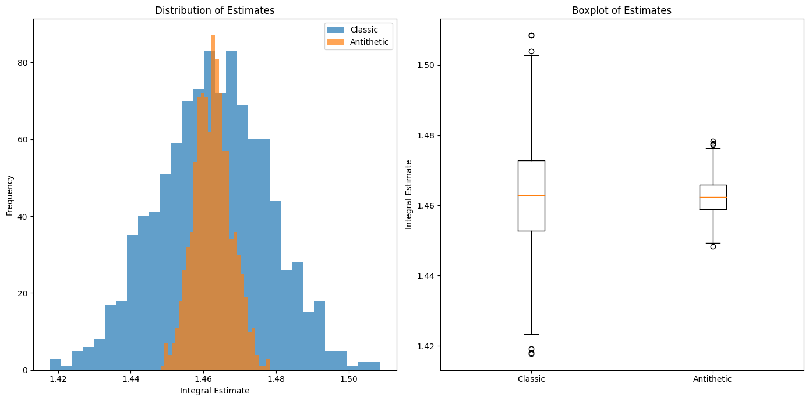
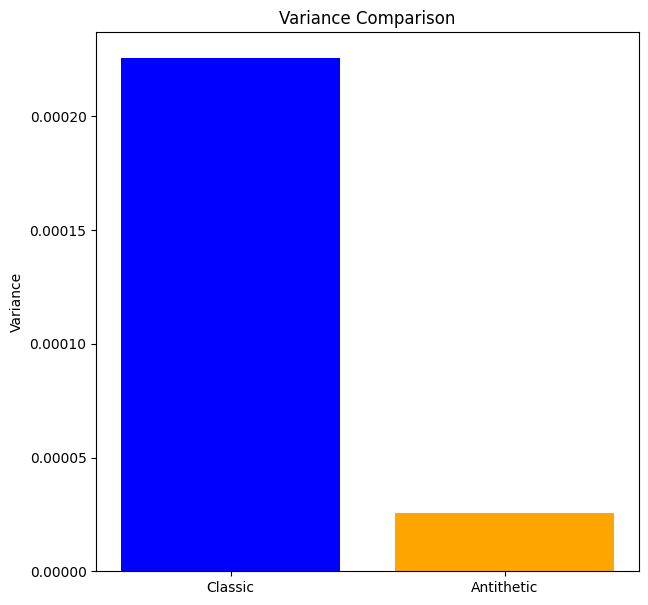

#  Monte Carlo Simulation: Variance Reduction

## Introduction

Monte Carlo simulations are a powerful tool for estimating integrals, especially when the integrand is complex and high-dimensional. One common challenge with Monte Carlo methods is the high variance of the estimates, which necessitates a large number of samples to achieve desired accuracy. 

# Antithetic Variables

Antithetic variables are a variance reduction technique that can significantly improve the efficiency of Monte Carlo simulations.

Consider the problem of estimating the integral of a function $ f(x) $ over the interval $[a, b]$:

$$ I = \int_a^b f(x) \, dx. $$

In a classic Monte Carlo approach, we estimate this integral by generating $ n $ independent samples $ X_i $ uniformly distributed over $[a, b]$ and computing the sample mean:

$$ \hat{I}_{\text{classic}} = (b - a) \frac{1}{n} \sum_{i=1}^n f(X_i). $$

The variance of this estimator is given by:

$$ \text{Var}(\hat{I}_{\text{classic}}) = \frac{(b - a)^2}{n} \text{Var}(f(X)). $$

To reduce this variance, we use antithetic variables. For each random sample $ X_i $, we generate an antithetic sample $ \tilde{X}_i $ defined as:

$$ \tilde{X}_i = a + b - X_i. $$

The antithetic estimator of the integral is then given by:

$$ \hat{I}_{\text{antithetic}} = (b - a) \frac{1}{2n} \sum_{i=1}^n \left( f(X_i) + f(\tilde{X}_i) \right). $$

To analyze the variance reduction, we consider the covariance between $ f(X_i) $ and $ f(\tilde{X}_i) $. The variance of the antithetic estimator is:

$$ \text{Var}(\hat{I}_{\text{antithetic}}) = \frac{(b - a)^2}{4n} \left( \text{Var}(f(X)) + \text{Var}(f(\tilde{X})) + 2 \text{Cov}(f(X), f(\tilde{X})) \right). $$

Since $ f(X) $ and $ f(\tilde{X}) $ are symmetrically distributed, we have $ \text{Var}(f(X)) = \text{Var}(f(\tilde{X})) $, and the expression simplifies to:

$$ \text{Var}(\hat{I}_{\text{antithetic}}) = \frac{(b - a)^2}{2n} \left( \text{Var}(f(X)) + \text{Cov}(f(X), f(\tilde{X})) \right). $$

If $ f(X) $ and $ f(\tilde{X}) $ are negatively correlated, i.e., $ \text{Cov}(f(X), f(\tilde{X})) < 0 $, the variance of the antithetic estimator is less than that of the classic estimator.

## Application to a Complex Function

Let us consider the function $ f(x) = e^{x^2} $ and estimate the integral over $[0, 1]$:

$$ I = \int_0^1 e^{x^2} \, dx. $$

For the classic Monte Carlo estimation, we generate $ n $ samples $ X_i \sim U(0, 1) $ and compute:

$$ \hat{I}_{\text{classic}} = \frac{1}{n} \sum_{i=1}^n e^{X_i^2}. $$

For the antithetic estimation, for each $ X_i $, we generate $ \tilde{X}_i = 1 - X_i $ and compute:

$$ \hat{I}_{\text{antithetic}} = \frac{1}{2n} \sum_{i=1}^n \left( e^{X_i^2} + e^{(1 - X_i)^2} \right). $$

## Simulation Results

To empirically demonstrate the variance reduction, we performed 1000 simulations with 1000 samples each. The results are summarized as follows:

- Variance of classic estimator: $ \text{Var}(\hat{I}_{\text{classic}}) = \sigma^2_{\text{classic}} $
- Variance of antithetic estimator: $ \text{Var}(\hat{I}_{\text{antithetic}}) = \sigma^2_{\text{antithetic}} $

### Distribution of Estimates v Boxplot of Estimates




### Variance Comparison



## Conclusion

The use of antithetic variables in Monte Carlo simulations significantly reduces the variance of the estimator. In the case of estimating the integral of $ f(x) = e^{x^2} $ over $[0, 1]$, the antithetic estimator showed a marked reduction in variance compared to the classic estimator. This demonstrates the effectiveness of antithetic variables as a variance reduction technique in Monte Carlo simulations.


# Application and Verification of Girsanov's Theorem

## Theoretical Background

Girsanov's Theorem provides a mechanism for changing the probability measure in a way that transforms the drift of a Brownian motion, enabling the modeling of various financial instruments under different measures.

### Detailed Statement of Girsanov's Theorem

Consider a filtered probability space $(\Omega, \mathcal{F}, (\mathcal{F}_t)_{t \geq 0}, \mathbb{P})$, where $\mathcal{F}_t$ represents the natural filtration generated by a standard Brownian motion $W_t$ under the probability measure $\mathbb{P}$. Let $\theta_t$ be an $\mathcal{F}_t$-adapted process satisfying the Novikov condition:

$$ \mathbb{E}_{\mathbb{P}}\left[\exp\left(\frac{1}{2} \int_0^T \theta_s^2 \, ds\right)\right] < \infty $$

Define the process $\Lambda_t$ as follows:

$$ \Lambda_t = \exp\left( -\int_0^t \theta_s \, dW_s - \frac{1}{2} \int_0^t \theta_s^2 \, ds \right) $$

Then, $\Lambda_t$ is a strictly positive martingale under $\mathbb{P}$, and we can define a new probability measure $\mathbb{Q}$ on $(\Omega, \mathcal{F}_T)$ by:

$$ \frac{d\mathbb{Q}}{d\mathbb{P}} \bigg|_{\mathcal{F}_t} = \Lambda_t $$

Under the new measure $\mathbb{Q}$, the process:

$$ W_t^{\mathbb{Q}} = W_t + \int_0^t \theta_s \, ds $$

is a standard Brownian motion. This transformation allows us to reframe the dynamics of the original process $W_t$ under $\mathbb{Q}$, essentially embedding the drift $\theta_t$ into the new measure and simplifying the stochastic calculus involved.

### Implications and Applications

#### Risk-Neutral Pricing

In financial mathematics, the risk-neutral measure $\mathbb{Q}$ is used for pricing derivative securities. If $S_t$ represents the price of a risky asset under the real-world measure $\mathbb{P}$, its dynamics can be described by:

$$ dS_t = \mu S_t \, dt + \sigma S_t \, dW_t $$

By switching to the risk-neutral measure $\mathbb{Q}$ via Girsanov's Theorem, the drift term $\mu$ is replaced by the risk-free rate $r$:

$$ dS_t = r S_t \, dt + \sigma S_t \, dW_t^{\mathbb{Q}} $$

This transformation simplifies the valuation of derivatives by ensuring that discounted price processes are martingales under $\mathbb{Q}$.

#### Monte Carlo Simulation

In Monte Carlo simulations, the ability to switch between measures using Girsanov's Theorem is crucial for variance reduction techniques and for ensuring that the simulated paths accurately reflect the underlying financial dynamics.

## Numerical Simulation

We simulate a Brownian motion $W_t$ under the measure $\mathbb{P}$ and transform it into a new Brownian motion under the measure $\mathbb{Q}$ using a constant drift $\theta$.

### Python Code

```python
import numpy as np
import matplotlib.pyplot as plt

np.random.seed(42)

# Parameters of the simulation
T = 1.0  # Time horizon
N = 1000  # Number of time steps
dt = T / N  # Time step size
t = np.linspace(0, T, N+1)  # Time discretization
theta = 0.5  # Constant drift for simplicity
num_simulations = 100  # Number of simulations

# Initialize for multiple plots
fig, axs = plt.subplots(3, 2, figsize=(14, 18))
fig.suptitle('Application and Verification of Girsanov\'s Theorem')

# Store trajectories for calculating the mean
trajectories_W = np.zeros((num_simulations, N+1))
trajectories_W_Q = np.zeros((num_simulations, N+1))

for i in range(num_simulations):
    # Generate Brownian motion W_t under measure P
    dW = np.random.normal(0, np.sqrt(dt), size=N)
    W = np.cumsum(dW)
    W = np.insert(W, 0, 0)  # W_0 = 0

    # Calculate Brownian motion under Q using Girsanov
    W_Q = W + theta * t

    # Store trajectories
    trajectories_W[i] = W
    trajectories_W_Q[i] = W_Q

    # Plot trajectories for one simulation
    if i == 0:
        axs[0, 0].plot(t, W, label='W_t under P (Brownian motion)')
        axs[0, 0].plot(t, W_Q, label='W_t under Q (After measure change)')
    else:
        axs[0, 0].plot(t, W, alpha=0.3)
        axs[0, 0].plot(t, W_Q, alpha=0.3)
axs[0, 0].set_title('Trajectories of W_t under P and Q')
axs[0, 0].legend()
axs[0, 0].grid(True)

# Comparison of increments
dW_Q = dW + theta * dt
axs[0, 1].hist(dW, bins=60, alpha=0.5, label='dW under P', density=True, color='blue', edgecolor='black')
axs[0, 1].hist(dW_Q, bins=60, alpha=0.5, label='dW under Q', density=True, color='red', edgecolor='black')
axs[0, 1].set_title('Distribution of increments')

# Calculate the Radon-Nikodym derivative
Z_t = np.exp(-theta * W - 0.5 * theta**2 * t)
axs[1, 0].plot(t, Z_t, label='Radon-Nikodym derivative $Z_t$')
axs[1, 0].set_title('Radon-Nikodym derivative $\dfrac{d\mathbb{Q}}{d\mathbb{P}}$')
axs[1, 0].legend()
axs[1, 0].grid(True)

# Verify the mean and variance of the processes under Q
mean_W_Q = []
var_W_Q = []
for i in range(num_simulations):
    dW = np.random.normal(0, np.sqrt(dt), size=N)
    W = np.cumsum(dW)
    W = np.insert(W, 0, 0)  # W_0 = 0
    W_Q = W + theta * t
    mean_W_Q.append(np.mean(W_Q))
    var_W_Q.append(np.var(W_Q))
axs[1, 1].bar(['Mean', 'Variance'], [np.mean(mean_W_Q), np.mean(var_W_Q)], yerr=[np.std(mean_W_Q), np.std(var_W_Q)], capsize=5)
axs[1, 1].set_title('Mean and Variance of $W_t^{\mathbb{Q}}$')
axs[1, 1].grid(True)

# Calculate and plot the mean of the trajectories under P and Q
mean_trajectory_W = np.mean(trajectories_W, axis=0)
mean_trajectory_W_Q = np.mean(trajectories_W_Q, axis=0)
axs[2, 0].plot(t, mean_trajectory_W, label='Mean of W_t under P')
axs[2, 0].plot(t, mean_trajectory_W_Q, label='Mean of W_t under Q')
axs[2, 0].set_title('Mean of Trajectories under P and Q')
axs[2, 0].legend()
axs[2, 0].grid(True)

# Mean and variance of W_T under P
W_T = trajectories_W[:, -1]
mean_W_T_P = np.mean(W_T)
var_W_T_P = np.var(W_T)
axs[2, 1].bar(['Mean', 'Variance'], [mean_W_T_P, var_W_T_P], yerr=[np.std(W_T), np.std(W_T)], capsize=5)
axs[2, 1].set_title('Mean and Variance of $W_T^{\mathbb{P}}$')
axs[2, 1].grid(True)

plt.tight_layout(rect=[0, 0, 1, 0.96])
plt.show()
```

## Plots

The following plots are generated from the code above:


## Description of Results

1. **Trajectories of $W_t$ under $\mathbb{P}$ and $\mathbb{Q}$**:
    - The trajectories under $\mathbb{P}$ (Brownian motion) oscillate around zero with increasing variance over time.
    - The trajectories under $\mathbb{Q}$ show a clear positive drift compared to those under $\mathbb{P}$.

2. **Distribution of increments**:
    - The increments $dW$ under $\mathbb{P}$ follow a normal distribution centered around zero.
    - The increments $dW^{\mathbb{Q}}$ are also normally distributed but centered around $\theta \cdot dt$.

3. **Radon-Nikodym derivative**:
    - The Radon-Nikodym derivative $Z_t$ fluctuates around 1, which is consistent with the drift introduced.

4. **Mean and variance of $W_t^{\mathbb{Q}}$**:
    - The mean of $W_t^{\mathbb{Q}}$ is around 0.5, which is expected due to the drift.
    - The variance of $W_t^{\mathbb{Q}}$ is around 1, indicating that the properties of the Brownian motion are preserved under the new measure.

5. **Mean of trajectories under $\mathbb{P}$ and $\mathbb{Q}$**:
    - The mean of the trajectories under $\mathbb{P}$ oscillates around zero.
    - The mean of the trajectories under $\mathbb{Q}$ shows a linear increase with a slope of 0.5, corresponding to the drift.

6. **Mean and variance of $W_T^{\mathbb{P}}$**:
    - The mean of $W_T^{\mathbb{P}}$ is close to zero.
    - The variance of $W_T^{\mathbb{P}}$ is close to 1, as expected for a standard Brownian motion.

